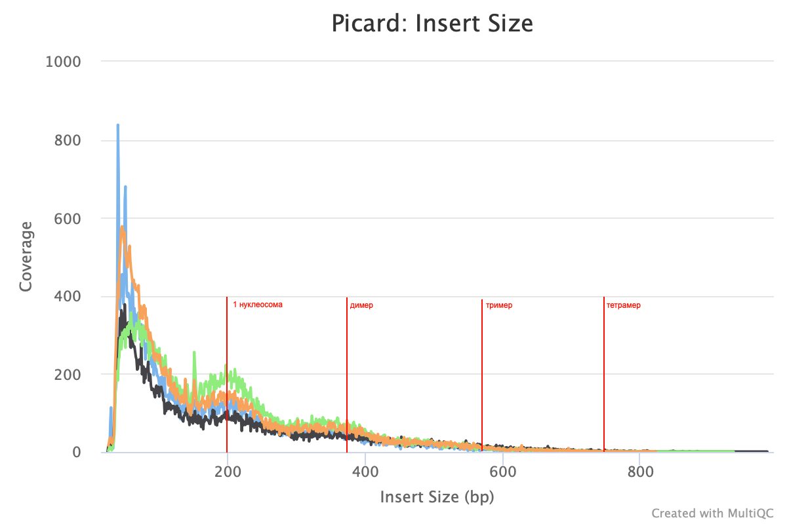

# ATAC_seq

Данные: OSMOTIC_STRESS_T15_R2_T1_2

#### Задание 0 (0,5 балла). Кратко опишите суть эксперимента

ATAC-seq выполняли на S. cerevisiae, подвергающихся осмотическому стрессу. 

штамм: BY4741

фаза роста: mid-log (для T15)

обработка: 0.6 M NaCl 15 minutes

#### Задание 1 (1 балл): какая команда используется для запуска анализа?
```
$ nextflow run nf-core/atacseq -profile test
```
#### Задание 2 (0,5 балла): Приведите содержание вашей рабочей директории по окончанию выполнения команды
```
$ ls

atacseq  results  work
```
#### Задание 3 (0,5 балла): Приведите имя вашего запуска
```
Run Name             : sleepy_descartes
```
#### Задание 4 (0,5 балла): Приведите добавочный параметр для поиска транскрипционных факторов
```
$ nextflow run nf-core/atacseq -profile test -resume sleepy_descartes --narrow_peak
```
#### Задание 5 (1 балл): Какова Fraction of Reads in Peaks для двух запусков? Почему? Удовлетворяют ли критерию? Связано ли с количеством пиков?

Широкие пики:


Узкие пики (транскрипционные факторы):


В качестве критерия доли ридов в пиках считают границу 0.4. Для широких пиков получено что-то приемлемое, для узких показатель ниже. Число пиков для трансрипцонных факторов также уменьшилось, что говорит о положительной взаимосвязи. Скорее всего чем уже мы берем пик, тем меньшее число ридов на него попадает, поэтому FRiP стал хуже.

#### Задание 6 (1 балл): Достаточна ли глубина секвенирования? У какой хромосомы наибольшее покрытие?

Наибольшее число ридов пришлось на 12 хромосому. Глубина секвенирования кажется небольшой, порядка 10 тысяч ридов на хромосому.

#### Задание 7 (2 балл): Какой размер нуклеосомы исходя из вашего графика. Отметьте это на графике, добавьте в отчет и поясните + Задание 8 (1 балл): Найдите нуклеосомные димеры, тримеры, тетрамеры.

Первый крупный пик после слишком мелких значений находится на значении около 200 пар оснований. Именно это значение соответствует длине днк, намотанной на нуклесому. Слудующий пик в районе 380 bp. Это значение для димера - двух нуклеосом. Значение меньше 400 bp, возможно две нуклеосомы сидят друг к другу плотнее и нужно чуть меньше ДНК, чтобы их покрыть. Далее пики не видны, так как шкала не логарифмическая, но можно предположить, что они были бы на ~560-580 bp и ~740-780 bp. Я дорисовала эти значения на графике:



#### Задание 9 (1 балла): Какие нашлись мотивы? Приложите лого лучшего из них. Является ли эта находка статистически значимой?

Создадим fasta файл из narrowPeak файла и geneome.fa
```
less results/bwa/mergedReplicate/macs/narrowPeak/OSMOTIC_STRESS_T15.mRp.clN_peaks.narrowPeak
cut -f 1-6 results/bwa/mergedReplicate/macs/narrowPeak/OSMOTIC_STRESS_T15.mRp.clN_peaks.narrowPeak > output.bed
cp results/genome/genome.fa .
bedtools getfasta -fi genome.fa -bed output.bed > output.fa
```
Запустим MEME со следующими параметрами:
```
meme output.fa -dna -oc . -nostatus -time 18000 -mod zoops -nmotifs 5 -minw 6 -maxw 20 -objfun classic -revcomp -markov_order 2
```

Нашелся один значимый мотив:


#### Задание 10 (1 балла): Запустите поиск похожих мотивов с помощью Tomtom. Приложите лого наиболее похожего. Является ли эта находка статистически значимой? Опишите функцию данного транскрипционного фактора

С помощью TOMTOM нашлись следующие похожие мотивы:
UP00097_2 (Mtf1_secondary),  MA1125.1 (ZNF384),  MA0050.2 (IRF1),  MA0442.2 (SOX10),  UP00037_1 (Zfp105_primary),  CPEB1_full

Результат можно найти по ссылке: http://meme-suite.org/opal-jobs/appTOMTOM_5.3.0_16071195451201823031279/tomtom.html#match_0_5

Однако все совпадения имеют не очень надежный уровень значимости. Минимльное занчение е-value 5.45e-01 для металл-регуляторного фактора транскрипции.
Его лого:


